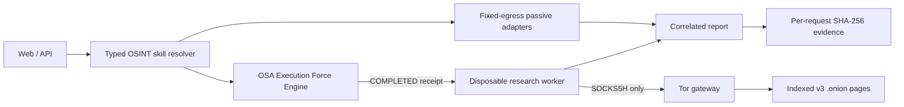

# Sherlock OSA

**Open-source, skill-driven OSINT agent do badania własnej ekspozycji i legalnego białego wywiadu.**

Sherlock OSA przyjmuje e-mail, numer telefonu, imię i nazwisko, username, domenę
albo IP. Deterministyczny resolver wybiera właściwe skille, uruchamia pasywne
źródła równolegle, oddziela fakty od kandydatów i buduje per-request evidence
ledger z łańcuchem SHA-256.

To jest wersja `v0.2.0`. Nie jest agregatorem skradzionych haseł i nie zwraca
surowych rekordów z wycieków. Raportuje nazwy źródeł ekspozycji oraz metadane,
które pomagają właścicielowi konta podjąć działania obronne.

## Co działa

- automatyczne rozpoznawanie `EMAIL | PHONE | PERSON | USERNAME | DOMAIN | IP`;
- normalizacja telefonu do E.164 z wyborem regionu;
- live lookup wycieków e-mail w XposedOrNot;
- opcjonalny lookup e-mail/telefon/username w LeakCheck v2 przez własny klucz;
- publiczne encje osób z Wikidata i kontrolowane pivoty wyszukiwarek;
- username: live profil GitHub, mapa publicznych profili i prywatne adaptery
  Sherlock/Maigret/WhatsMyName;
- domena/IP: DNS, reverse DNS oraz RDAP bez ujawniania kontaktów osobowych;
- wyszukiwanie w clearnetowym indeksie Ahmia, jawnie oznaczone jako
  `INDEX_MATCH_NOT_CONTENT_VERIFIED`;
- opcjonalna weryfikacja treści `.onion` w osobnym workerze, którego jedyną
  trasą wyjścia jest brama Tor;
- 10 jawnych skill contracts w [`skills/`](skills/) i widoczny execution trace;
- 20-repo benchmark narzędzi OSINT z licencjami i decyzjami integracyjnymi;
- brak zapisu surowego identyfikatora w evidence ledgerze i brak trwałości
  publicznego preview.

## Granica prawdy

„Cały Deep Web” nie jest skończonym ani kompletnie indeksowalnym zbiorem.
Sherlock OSA nie udaje, że istnieje jeden globalny indeks. Publiczny runtime pyta
Ahmię i raportuje wyłącznie wynik indeksu. Prywatny worker może następnie pobrać
przez Tor maksymalnie pięć znalezionych stron v3 `.onion`, sprawdzić obecność
identyfikatora i zwrócić tylko URL, tytuł, rozmiar oraz SHA-256 treści — bez
surowej strony i bez danych logowania.

| Runtime | Live źródła pasywne | Ahmia | Bezpośrednie `.onion` | OSA Engine |
|---|---:|---:|---:|---:|
| publiczny preview | tak | tak | nie | nie |
| prywatny control plane | tak | tak | tylko worker Tor | wymagany |

## Architektura



Worker nie przyjmuje URL-a od użytkownika. Sam buduje zapytanie do Ahmii,
akceptuje wyłącznie znalezione hosty v3 `.onion`, nie używa shella, ma limit
czasu/rozmiaru i działa bez bezpośredniej sieci egress. Brak `COMPLETED` receiptu
z OSA Engine blokuje delegację.

Szczegóły: [`docs/ARCHITECTURE_LOCK_V0.2.md`](docs/ARCHITECTURE_LOCK_V0.2.md)
i [`docs/THREAT_MODEL.md`](docs/THREAT_MODEL.md).

## Szybki start — publiczne źródła

Wymagany jest Python 3.12+.

```bash
git clone https://github.com/HazEOskA/OSINT-AGENT-SHERLOCK-OSA.git
cd OSINT-AGENT-SHERLOCK-OSA
python3 -m venv .venv
. .venv/bin/activate
python -m pip install -e .
cp .env.example .env
```

Prywatny serwer wymaga [OSA Execution Force Engine](https://github.com/HazEOskA/osa-execution-force-skills)
przypiętego do SHA `f365360383511fea13cd3f7af36ecbbc720ce38d`.
Po ustawieniu sekretów:

```bash
sherlock-osa serve --env-file .env
```

Panel: `http://127.0.0.1:8787`.

Przykładowe zapytanie API:

```bash
curl -sS http://127.0.0.1:8787/api/v1/osint/investigate \
  -H "Authorization: Bearer $SHERLOCK_API_KEY" \
  -H "Content-Type: application/json" \
  -d '{
    "query":"+48 500 600 700",
    "kind":"PHONE",
    "default_region":"PL",
    "purpose":"SELF_AUDIT",
    "include_darkweb":true,
    "consent":true
  }'
```

## Prywatny research worker Tor

Ustaw unikalny `OSA_RESEARCH_WORKER_TOKEN`, a potem:

```bash
docker compose -f compose.research.yaml up --build
```

Topologia Compose rozdziela sieci. Worker widzi control plane i wewnętrzną
`tor-lane`, ale nie jest podłączony do zwykłego egressu. Tylko `tor-gateway`
łączy `tor-lane` z `tor-egress`.

## Skille

Registry zawiera 10 kontraktów:

1. `osint.query-classification`
2. `osint.phone-intelligence`
3. `osint.email-exposure`
4. `osint.person-discovery`
5. `osint.username-discovery`
6. `osint.domain-intelligence`
7. `osint.ip-intelligence`
8. `osint.darkweb-index-search`
9. `osint.pivot-correlation`
10. `osint.evidence-report`

Każdy raport zwraca plan, adaptery, status, czas, liczbę findings/pivotów i hash
evidence. Definicje maszynowe są w
[`src/sherlock_osa/osint_skills.json`](src/sherlock_osa/osint_skills.json).

## Benchmark 20 repo

Lista obejmuje m.in. OpenOSINT, SpiderFoot, Sherlock, Maigret, PhoneInfoga,
Holehe, GHunt, Recon-ng, Amass, WhatsMyName, XposedOrNot, h8mail, MOSINT,
Social Analyzer, Ignorant, Ahmia Crawler, Robin, Sosse, Harpoon i Osintgram.
Metadane i licencje zweryfikowano 2026-08-15. Nie vendorujemy ich kodu; GPL/AGPL
pozostają osobnymi procesami lub inspiracją interfejsu.

Pełna tabela:
[`docs/REFERENCE_BENCHMARK_2026-08-15.md`](docs/REFERENCE_BENCHMARK_2026-08-15.md).

## Walidacja

```bash
python3 scripts/verify.py
python3 scripts/smoke.py
python3 scripts/smoke_demo.py
python3 scripts/smoke_osint.py
```

## Bezpieczeństwo i legalność

Używaj wyłącznie do self-audytu, badań za zgodą, obrony organizacji lub
udokumentowanego interesu publicznego. Wynik `NO_MATCH` nie dowodzi braku
ekspozycji, a kandydat osoby nie jest potwierdzoną tożsamością. Zgłoszenia
bezpieczeństwa: [`SECURITY.md`](SECURITY.md).

## Licencja

Kod Sherlock OSA: Apache-2.0. Zewnętrzne źródła i narzędzia zachowują swoje
licencje oraz regulaminy.
