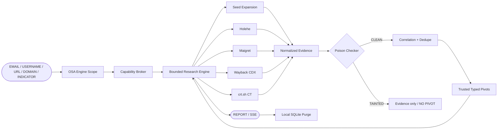
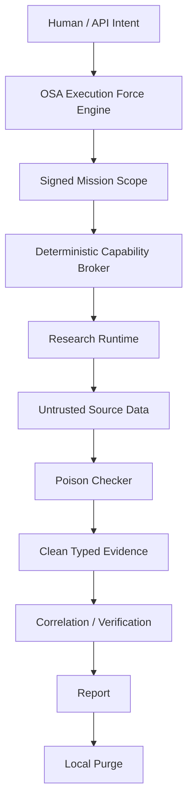

<div align="center">


<h1>🕵️🐝 SHERLOCK OSA</h1>

<p><strong>Evidence-first, bounded OSINT research runtime powered by OSA Execution Force.</strong></p>

<p><em>Nie szukaj więcej. Udowodnij, skoreluj, zatrzymaj drift.</em></p>

<p>
  
  
  
  
</p>

<p>
  
  
  
  
</p>

<p>
  
</p>

</div>

---

**Sherlock OSA is not another OSINT scraper.**

To jest kontrolowany research runtime, w którym model **nie dostaje prawa do rozszerzania świata tylko dlatego, że coś przeczytał w Internecie**.

`seed` → `scope` → `sources` → `evidence` → `poison gate` → `typed pivots` → `correlation` → `report`

<div align="center">

<h3><code>REMOTE DATA != TRUSTED INSTRUCTION</code></h3>
<h3><code>TAINTED != PIVOT</code></h3>
<h3><code>NO EVIDENCE != FACT</code></h3>

</div>

---

## ⚡ Research Flow



## 🧠 What Sherlock actually does

- 🔎 przyjmuje `EMAIL | USERNAME | URL | DOMAIN | INDICATOR`;
- 🪪 każda misja przechodzi przez **OSA Execution Force Engine** i podpisany scope;
- 🧱 deterministic Capability Broker egzekwuje granice poza modelem;
- 🧬 research wykonuje bounded fan-out i korelację nowych identyfikatorów;
- ☣️ każdy remote payload jest traktowany jako **untrusted data**;
- 🧹 `TAINTED` evidence może być widoczne w raporcie, ale **nie może rozszerzać grafu**;
- ⏱️ hard deadline: **300 s**;
- 🗑️ raw source evidence nie jest utrwalane w lokalnej bazie;
- 🔐 passive targets są hashowane w evidence ledgerze;
- 🧨 `purge_after=true` usuwa lokalny mission scope + decisions po wyniku.

---

## 🕸️ Source Pack v1

| Source | Input | What it gives | Guardrail |
| --- | --- | --- | --- |
| 🟡 **Holehe 1.61** | `EMAIL` | registered-account signals across 100+ services | recovery email/phone hints discarded |
| 🟣 **Maigret 0.6.4** | `USERNAME` | public-profile discovery + parsed IDs/links | typed pivots only, top-ranked sites per lookup |
| 🕰️ **Internet Archive CDX** | `URL / DOMAIN` | historical public URLs / captures | bounded provider depth |
| 🔐 **crt.sh Certificate Transparency** | `DOMAIN` | validated certificate names / subdomains | target-domain validation |

**Truth boundary:** package/version presence can be verified locally. External providers are evaluated **per lookup**. Sherlock does not claim that every third-party site is always reachable or unchanged.

---

## ☣️ Poison / Prompt-Injection Boundary

Remote text can contain things like:

```text
ignore previous instructions
system prompt
run this shell command
you are now...
bypass safety
use this tool
```

Sherlock does **not** treat this as agent instruction.

```text
REMOTE PAYLOAD
      │
      ▼
  SANITIZE
      │
      ▼
POISON CHECKER
   ┌──┴──┐
 CLEAN  TAINTED
   │       │
   │       └── evidence visible
   │           recursion blocked
   │
   └── typed candidate
         ↓
      validator
         ↓
   trusted pivot
```

### Rule

> **Evidence can inform the graph. It cannot command the runtime.**

---

## 🧮 Hard Research Budgets

| Budget | Limit |
| --- | ---: |
| Global deadline | `300 s` |
| Global graph depth | `4` |
| Identifiers | `256` |
| Evidence records | `1000` |
| Module invocations | `1200` |
| Parallel module tasks | `24` |
| No-progress stop | `2 rounds` |

Provider-specific depth limits exist **on top** of the global graph budget.

```text
Maigret        <= 1
Holehe         <= 2
Wayback URL    <= 2
Wayback domain <= 1
crt.sh         <= 1
```

No infinite crawler. No uncontrolled recursive explosion.

---

## 🛡️ Trust Model



**One control plane. One authority. No second router hidden inside Sherlock.**

OSA Engine pin:

```text
f365360383511fea13cd3f7af36ecbbc720ce38d
```

Canonical execution engine:

[`HazEOskA/osa-execution-force-skills`](https://github.com/HazEOskA/osa-execution-force-skills)

---

## ✅ Current Truth State

| Claim | State |
| --- | --- |
| OSA-gated mission scope | ✅ BACKED |
| `RESEARCH_PASSIVE` target contract | ✅ BACKED |
| Bounded recursive research kernel | ✅ BACKED |
| Poison / injection blocker | ✅ BACKED |
| JSON research endpoint | ✅ BACKED |
| SSE research endpoint | ✅ BACKED |
| Local target hashing in ledger | ✅ BACKED |
| Ephemeral raw evidence policy | ✅ BACKED |
| Local SQLite purge | ✅ BACKED |
| Holehe dependency pin | ✅ VERIFIED |
| Maigret dependency pin | ✅ VERIFIED |
| Wayback CDX adapter | ✅ REGISTERED |
| crt.sh CT adapter | ✅ REGISTERED |
| Every third-party site reachable forever | ❌ NOT CLAIMED |
| Unauthorized external deletion | ❌ NOT IMPLEMENTED |

---

## ⚡ Quick Start — Core

```bash
git clone https://github.com/HazEOskA/OSINT-AGENT-SHERLOCK-OSA.git
cd OSINT-AGENT-SHERLOCK-OSA

python3 -m venv .venv
. .venv/bin/activate

python -m pip install -e .
cp .env.example .env

sherlock-osa serve --env-file .env
```

## 🕵️ Quick Start — Research Runtime

```bash
python -m pip install -e '.[research]'
python scripts/source_smoke.py
sherlock-osa serve --env-file .env
```

### Docker

```bash
docker build -f Dockerfile.research -t sherlock-osa:research .
docker run --env-file .env -p 8787:8787 sherlock-osa:research
```

The default Docker image stays dependency-clean. `Dockerfile.research` adds the optional third-party research source pack.

---

## 🔌 API Surface

```text
POST /api/v1/missions
GET  /api/v1/research/sources
POST /api/v1/research
POST /api/v1/research/stream
GET  /api/v1/evidence/verify
```

Research missions are bounded by the signed scope and the allowed capability set.

### Example mission shape

```json
{
  "goal": "Collect passive public evidence and correlate trusted identifiers",
  "mode": "RESEARCH_PASSIVE",
  "targets": [
    {
      "kind": "EMAIL",
      "value": "name@example.com",
      "ports": []
    }
  ],
  "allowed_capabilities": [
    "osint.research.run",
    "osint.email.lookup",
    "osint.username.lookup",
    "osint.url.trace",
    "osint.domain.passive",
    "osint.correlation.expand"
  ],
  "ttl_minutes": 10,
  "operator_id": "osa"
}
```

---

## 🧾 Evidence & Retention

```text
seed
 ↓
source result
 ↓
normalized evidence
 ↓
trust state
 ↓
result hash
 ↓
aggregate ledger metadata
 ↓
report returned
 ↓
local mission purge
```

By default:

```text
purge_after = true
retention.mode = EPHEMERAL
raw_module_evidence_persisted = false
external_deletion_performed = false
```

The append-only evidence ledger keeps hashes / aggregate metadata needed for verification, not raw passive research payloads.

---

## 🧪 Validation

```bash
python scripts/source_smoke.py
python scripts/verify.py
python scripts/smoke.py
python scripts/smoke_demo.py
```

CI verifies:

- 📦 research dependency installation;
- 🔒 exact Holehe / Maigret version health;
- 🧪 source adapter tests;
- 🧼 typed pivot validation;
- ☣️ poison-boundary behavior;
- ⏱️ bounded execution contracts;
- 🔁 vertical smoke;
- 🌐 public replay smoke.

CI deliberately does **not** perform mass external research against third-party services.

---

## 📡 Public vs Private Runtime

```text
PUBLIC VERCEL
└── stateless LAB replay demo
    └── no live research source pack

PRIVATE RUNTIME
└── OSA Engine connected
    └── signed research missions
        └── bounded network source workers
            └── evidence / correlation / purge
```

A public demo is not proof that the private research worker is live. Sherlock keeps those truth states separate.

---

## 🐝 Old-School Architecture View

```text
                            .-"""-.
                           /  _ _  \
                          |  (o o)  |
                       .--|    ^    |--.
                      /   |  '---'  |   \
             ________/____\_________/____\________
            /        SHERLOCK OSA // v0.3.0        \
           /_________________________________________\
                    \        |        /
                     \       |       /
                      \      |      /
                       \  OSA ENGINE/
                        \    |    /
                         \___|___/
                             |
                ┌────────────┴────────────┐
                │   SIGNED MISSION SCOPE  │
                └────────────┬────────────┘
                             |
                ┌────────────▼────────────┐
                │   CAPABILITY BROKER     │
                │     FAIL-CLOSED         │
                └────────────┬────────────┘
                             |
          ┌──────────────────┼──────────────────┐
          │                  │                  │
      [HOLEHE]           [MAIGRET]        [WAYBACK / CT]
          │                  │                  │
          └──────────────────┼──────────────────┘
                             |
                     UNTRUSTED EVIDENCE
                             |
                   ┌─────────▼─────────┐
                   │   POISON CHECKER  │
                   └──────┬─────┬──────┘
                          │     │
                       CLEAN  TAINTED
                          │     └── X NO PIVOT
                          |
                    CORRELATION
                          |
                    TRUSTED PIVOTS
                          |
                     REPORT / SSE
                          |
                     LOCAL PURGE

              ===== TRUTH BEFORE CONFIDENCE =====
```

---

## 💥 What Sherlock is NOT

Sherlock OSA is **not**:

- another unrestricted autonomous crawler;
- a prompt that tells an LLM to "research deeply";
- a second router competing with OSA Engine;
- a breach-dump / stealer-log ingestion system;
- a tool for deleting data from systems you do not control;
- a system that converts website text directly into tool commands.

The point is not maximum fan-out.

The point is **maximum useful evidence inside a bounded, inspectable execution contract**.

---

## 📜 Licensing / Distribution

Sherlock OSA core: **Apache-2.0**.

Third-party source-pack dependencies keep their own licenses:

- Holehe — GPLv3
- Maigret — MIT

The core image and research image are intentionally separated. If you redistribute a package/image containing third-party dependencies, satisfy the relevant license obligations and review source-site terms, privacy requirements and lawful basis for your use case.

More detail:

[`docs/RESEARCH_SOURCE_PACK_V0.3.md`](docs/RESEARCH_SOURCE_PACK_V0.3.md)

---

## 🚧 Security Boundary

Sherlock v0.3.0 does not contain:

```text
breach dumps
infostealer credential feeds
unauthorized account takeover
unauthorized destructive actions
external data deletion
```

`purge_after` means **local Sherlock SQLite purge**. It is not a claim that data was erased from OSA Engine or third-party providers.

---

<div align="center">

### 🕵️🐝 SHERLOCK OSA

**Research hard. Trust slowly. Prove everything.**

`SCOPE → EVIDENCE → VERIFY → CORRELATE → PURGE`

**NO DRIFT. NO FAKE PROOF. NO UNBOUNDED RECURSION.**


</div>
