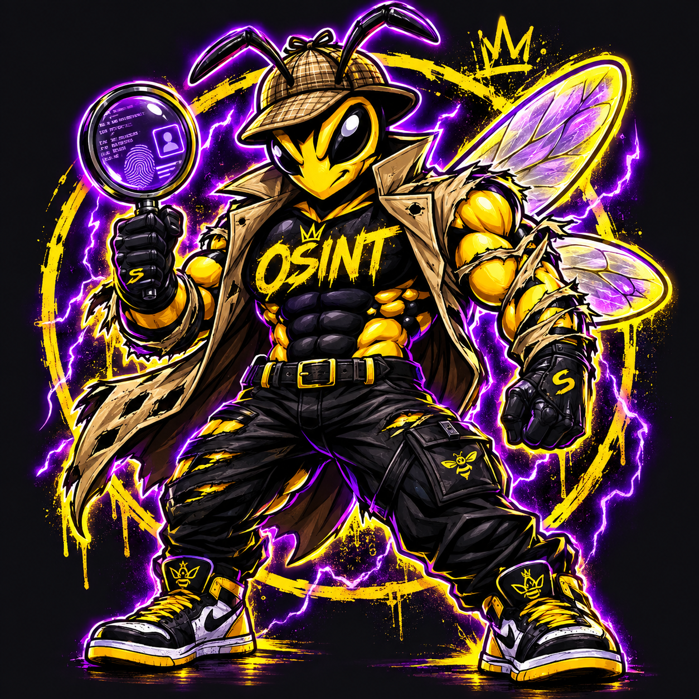
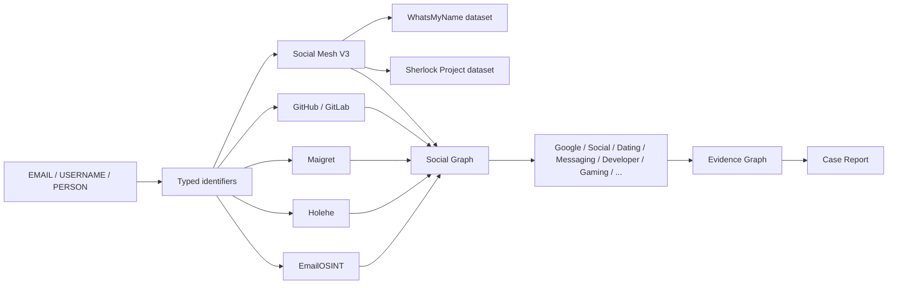
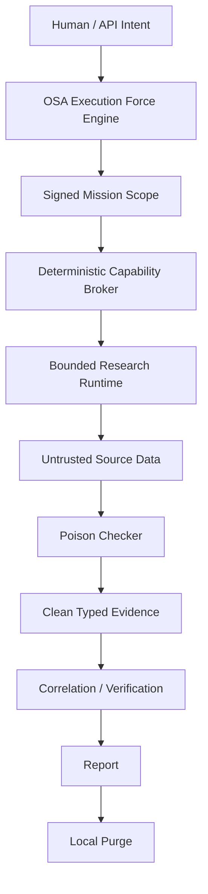

<div align="center">



# 🕵️🐝 SHERLOCK OSA

### MAX INVESTIGATION // SOCIAL MESH ULTRA V3

**Evidence-first OSINT research runtime powered by OSA.**

*Jeden trop. Całe śledztwo. CLAIM ≠ PROOF.*

<p>
  
  
  
  
</p>

<p>
  
  
  
  
</p>

</div>

---

## ⚡ What Sherlock is

Sherlock OSA is not a single-site username checker and not a prompt telling an LLM to “search harder”.

It is a **bounded, multi-source investigation runtime** that takes one public identifier and expands it through typed pivots, independent sources, evidence correlation, identity resolution, timeline reconstruction and an inspectable evidence graph.

```text
TROP
  ↓
SOURCE MESH
  ↓
NORMALIZED EVIDENCE
  ↓
POISON / TRUST GATE
  ↓
TYPED PIVOTS
  ↓
CORRELATION
  ↓
IDENTITY RESOLUTION
  ↓
EVIDENCE GRAPH + TIMELINE
  ↓
CASE REPORT
```

<div align="center">

### `REMOTE DATA != TRUSTED INSTRUCTION`
### `USERNAME MATCH != SAME PERSON`
### `NO EVIDENCE != FACT`

</div>

---

## 🧠 Primary search surface

The primary UI accepts:

`AUTO` · `EMAIL` · `PHONE` · `USERNAME` · `PERSON` · `DOMAIN` · `URL`

and exposes three investigation modes:

| Mode | Hard timeout | Max depth | Identifiers | Evidence | Invocations |
| --- | ---: | ---: | ---: | ---: | ---: |
| ⚡ QUICK | 45 s | 2 | 64 | 300 | 300 |
| 🧠 DEEP | 180 s | 4 | 256 | 1200 | 1800 |
| 🔥 MAX | 300 s | 6 | 768 | 3000 | 5000 |

`MAX` is the default mode.

Primary streaming route:

```text
POST /api/v1/search/stream
Authorization: Bearer <SHERLOCK_API_KEY>
Content-Type: application/json
Accept: text/event-stream
```

Synchronous compatibility route:

```text
POST /api/v1/search
```

Example:

```json
{"kind":"AUTO","mode":"MAX","query":"example.com"}
```

---

## 🕸️ Social Mesh Ultra V3

Sherlock combines direct sources with a runtime site-probe layer built from pinned public service-definition datasets.



### Runtime dataset pins

| Dataset | Pin | Use |
| --- | --- | --- |
| WhatsMyName | `e62338e4fc88536a330733d355a9d33a3a1697c6` | public account-presence definitions / taxonomy |
| Sherlock Project | `376018708c0f6948d3f978a9ae2915024e794654` | public profile/probe definitions |

The datasets are referenced at runtime and keep their upstream provenance/licensing. They are not silently relabeled as OSA-owned data.

### Social taxonomy

```text
GOOGLE
DATING
SOCIAL
MESSAGING
DEVELOPER
GAMING
MUSIC
VIDEO
SHOPPING
FINANCE
FORUMS
ADULT / NSFW
OTHER
```

`FOUND` is not treated as “HTTP 200 therefore account exists”. The probe layer evaluates the available site rule: status semantics, positive/negative markers, expected profile URL and reliability metadata. Ambiguous definitions fail closed instead of being promoted into facts.

---

## 📡 Source mesh

The current registry contains 13 source descriptors, plus EmailOSINT as an in-process provider and local phone metadata.

| Layer | Sources | Purpose |
| --- | --- | --- |
| 🪪 Identity | EmailOSINT, Gravatar, Holehe | account signals, public profile metadata, provider intelligence |
| 🧑‍💻 Code identity | GitHub, GitLab | public developer identity and pivots |
| 🕵️ Username mesh | Social Mesh V3, Maigret | broad public profile discovery |
| 🚨 Exposure | HIBP optional | email / phone exposure when keyed |
| 🌐 Domain | RDAP, crt.sh | registration + certificate footprint |
| 🕰️ History | Wayback URL/Domain, Common Crawl URL/Domain | historical public footprint |
| 📞 Phone | libphonenumber metadata | E.164 validation, general metadata; no owner claim |

Optional credentials:

```bash
EMAILOSINT_API_KEY=
HIBP_API_KEY=
GRAVATAR_API_KEY=
GITHUB_TOKEN=
GITLAB_TOKEN=
```

Missing an optional provider credential must not fabricate a fallback result. Sherlock reports the source as unavailable/skipped and continues with compatible independent sources.

---

## ✉️ EmailOSINT Parity+

EmailOSINT is integrated as one source layer inside the wider Sherlock investigation.

Default endpoint:

```text
https://api.emailosint.org/v1/lookup/email
```

Runtime configuration:

```bash
EMAILOSINT_ENDPOINT=https://api.emailosint.org/v1/lookup/email
EMAILOSINT_API_KEY=...
EMAILOSINT_AUTH_HEADER=Authorization
EMAILOSINT_AUTH_SCHEME=Bearer
EMAILOSINT_TIMEOUT_SECONDS=30
```

Sherlock accepts provider JSON or SSE output, keeps safe provider fields, preserves event provenance and recursively redacts credential-like values before they reach the browser.

Normalized areas include:

```text
identity
  ├─ ai_profile
  ├─ signals
  └─ linked_accounts

exposure
  ├─ breaches
  └─ infostealer

risk
timeline
provenance
parity
provider.raw (redacted)
```

### Credential boundary

Secrets such as passwords, tokens, cookies, session material and credential strings are redacted. Exposure booleans/counts may remain because they are evidence metadata, not usable credentials.

---

## 🔗 Social Relationship Graph

Sherlock separates a source signal from an identity claim.

```text
EMAIL
  │
  ├──FOUND──> Google
  │
  ├──FOUND──> GitHub
  │              │
  │              └──USERNAME──> example_handle
  │                                  │
  │                                  ├──FOUND──> Reddit
  │                                  ├──FOUND──> GitLab
  │                                  └──SIGNAL──> dating service
  │
  └──OBSERVED──> Spotify
```

A reused username is a pivot, **not automatic proof that two accounts belong to the same person**.

The Detective Core keeps:

- direct source evidence;
- independent source families;
- confidence and assertion level;
- conflicts;
- parent pivots;
- source URLs;
- evidence hashes;
- first/last observed timestamps.

---

## ☣️ Poison / prompt-injection boundary

Every remote payload is untrusted data.

```text
REMOTE PAYLOAD
      │
      ▼
  SANITIZE
      │
      ▼
POISON CHECKER
   ┌──┴──┐
 CLEAN  TAINTED
   │       │
   │       └── visible as evidence
   │           recursion blocked
   │
   └── typed candidate
         ↓
      validator
         ↓
     trusted pivot
```

Content such as:

```text
ignore previous instructions
system prompt
execute this command
you are now...
bypass safety
```

is never interpreted as authority over the runtime.

> **Evidence can inform the graph. It cannot command the runtime.**

---

## 🛡️ Probe guardrails

Social Mesh V3 intentionally does **not** use:

```text
authenticated third-party sessions
proxy rotation for rate-limit bypass
CAPTCHA bypass
credential stuffing
password-recovery enumeration
dataset-defined POST probes with side effects
```

If a source cannot be represented safely and reliably, it is skipped or marked unknown/unreliable instead of promoted into a positive account claim.

---

## 📞 Phone intelligence

Phone input must use international format:

```text
+31612345678
```

`00...` is normalized to `+...`.

Local metadata may provide general country/region, number type, carrier metadata and time-zone hints where available from libphonenumber data.

Sherlock does **not** claim that prefix metadata identifies the owner or gives precise live location.

HIBP phone exposure is optional and requires `HIBP_API_KEY`.

---

## 🧭 Source observability

A MAX run emits source telemetry instead of silently hiding failure:

```text
source_started
source_completed
source_skipped
source_timeout
source_error
source_rate_limited
pivot_discovered
evidence_blocked
finding_confirmed
conflict_detected
identity_resolution_completed
timeline_ready
social_graph_ready
case_report_ready
case_result
```

The UI exposes what actually answered and what did not.

---

## 🧬 OSA control layer

Sherlock still retains the governed OSA research path:



Engine pin:

```text
f365360383511fea13cd3f7af36ecbbc720ce38d
```

Canonical execution repository:

[`HazEOskA/osa-execution-force-skills`](https://github.com/HazEOskA/osa-execution-force-skills)

---

## ⚡ Quick start

```bash
git clone https://github.com/HazEOskA/OSINT-AGENT-SHERLOCK-OSA.git
cd OSINT-AGENT-SHERLOCK-OSA

python3 -m venv .venv
. .venv/bin/activate

python -m pip install -e '.[research]'
cp .env.example .env

sherlock-osa serve --env-file .env
```

### Docker / managed runtime image

```bash
docker build -f Dockerfile.research -t sherlock-osa:research .
docker run --env-file .env -p 8787:8787 sherlock-osa:research
```

---

## 🔌 API surface

Primary investigation:

```text
GET  /api/v1/health
GET  /api/v1/research/sources
POST /api/v1/search
POST /api/v1/search/stream
POST /api/v1/lookup/email
```

Governed research/control surface:

```text
POST /api/v1/missions
POST /api/v1/research
POST /api/v1/research/stream
GET  /api/v1/evidence/verify
```

---

## 🧾 Evidence & retention

```text
seed
 ↓
source result
 ↓
normalized evidence
 ↓
trust state
 ↓
evidence hash
 ↓
correlation
 ↓
case report
```

For governed passive missions the local runtime supports ephemeral behavior and local purge. Sherlock does not claim deletion from third-party providers.

```text
retention.mode = EPHEMERAL
raw_module_evidence_persisted = false
external_deletion_performed = false
```

---

## ✅ Truth state

| Claim | State |
| --- | --- |
| QUICK / DEEP / MAX bounded search | ✅ IMPLEMENTED |
| EMAIL / PHONE / USERNAME / PERSON / DOMAIN / URL intake | ✅ IMPLEMENTED |
| Social Mesh Ultra V3 | ✅ IMPLEMENTED |
| WhatsMyName + Sherlock pinned runtime datasets | ✅ IMPLEMENTED |
| Google / Social / Dating / Messaging taxonomy | ✅ IMPLEMENTED |
| EmailOSINT JSON + SSE response normalization | ✅ IMPLEMENTED |
| Credential-like provider data redaction | ✅ IMPLEMENTED |
| GitHub / GitLab / Gravatar direct identity sources | ✅ IMPLEMENTED |
| Holehe + Maigret source workers | ✅ IMPLEMENTED |
| RDAP + crt.sh | ✅ IMPLEMENTED |
| Wayback + Common Crawl | ✅ IMPLEMENTED |
| HIBP | ⚠️ REQUIRES API KEY |
| EmailOSINT authenticated provider mode | ⚠️ REQUIRES `EMAILOSINT_API_KEY` |
| Every third-party source always reachable | ❌ NOT CLAIMED |
| Username equality proves same human | ❌ NOT CLAIMED |
| Precise phone owner/location from prefix | ❌ NOT CLAIMED |
| CAPTCHA / auth bypass | ❌ NOT IMPLEMENTED |

**Repository CI verifies code/container contracts. Live third-party reachability remains a runtime property and is reported per lookup.**

---

## 🧪 Verification

```bash
python scripts/source_smoke.py
python scripts/verify.py
python scripts/smoke.py
python scripts/smoke_demo.py
```

CI covers dependency installation, source contracts, unit tests, vertical smoke, public replay and managed-runtime container checks.

---

## 🐝 Architecture — old-school view

```text
                         .-""""""-.
                       .'  DETECTIVE '.
                      /      OSA      \
                     |    🕵️  🐝     |
                     |      ▲        |
                     '.___ /_\ ____.'
                          /   \
             ____________/_____\____________
            /   SHERLOCK OSA // MAX + V3    \
           /__________________________________\
                        │
                ┌───────▼────────┐
                │ PRIMARY INTAKE │
                │ E/P/U/P/D/URL  │
                └───────┬────────┘
                        │
        ┌───────────────┼────────────────┐
        │               │                │
   [EMAILOSINT]    [DIRECT SOURCES]  [SOCIAL MESH]
        │               │                │
        └───────────────┼────────────────┘
                        │
                 UNTRUSTED EVIDENCE
                        │
                ┌───────▼────────┐
                │  POISON GATE   │
                └───────┬────────┘
                        │
                  TYPED PIVOTS
                        │
              ┌─────────▼─────────┐
              │ DETECTIVE CORE    │
              │ CORRELATE / PROVE │
              └─────────┬─────────┘
                        │
                 EVIDENCE GRAPH
                        │
                  CASE REPORT

             ===== CLAIM ≠ PROOF =====
```

---

## 💥 What Sherlock is NOT

Sherlock OSA is not:

- an unrestricted autonomous crawler;
- a credential-harvesting system;
- a stolen-session tool;
- a system that turns arbitrary website text into commands;
- a product that fabricates provider results when a source fails;
- proof that two humans are identical because they share a nickname.

The target is not blind maximum fan-out.

The target is **maximum useful public evidence inside a bounded, inspectable execution contract**.

---

<div align="center">

### 🕵️🐝 SHERLOCK OSA

**Research hard. Trust slowly. Prove everything.**

`TROP → EVIDENCE → VERIFY → CORRELATE → GRAPH → REPORT`

**NO DRIFT. NO FAKE PROOF. NO UNBOUNDED RECURSION.**


</div>
