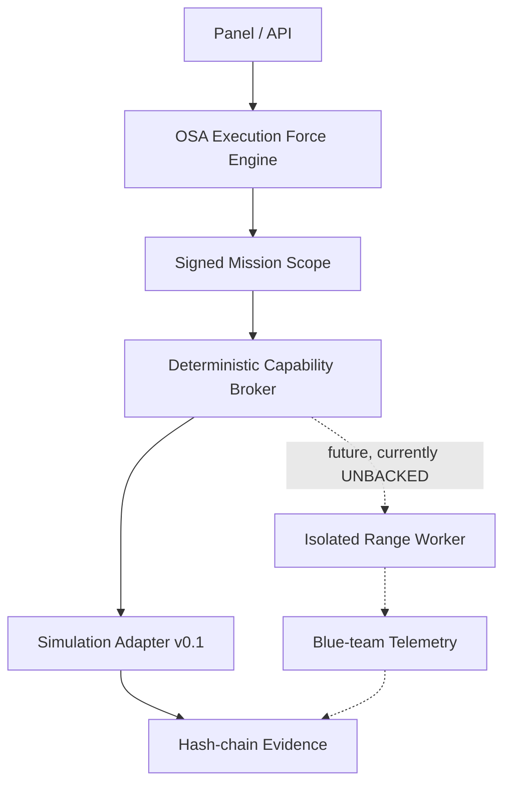

# Sherlock OSA

**Kontrolowane, evidence-first laboratorium bezpieczeństwa sterowane agentami.**

Sherlock OSA nie ufa modelowi językowemu jako granicy bezpieczeństwa. OSA
Execution Force Engine rozpoznaje intencję, wybiera kontrakt i prowadzi misję,
a deterministyczny broker poza modelem egzekwuje scope, target, port, trasę,
wygaśnięcie i stan evidence.

> Status `v0.1.1`: działający control-plane vertical slice oraz publiczny,
> stateless replay demo. Realne skanery,
> exploity, Tor, microVM, gVisor i sensory blue-team są celowo `UNBACKED`.
> Endpoint wykonawczy symuluje operację bez ruchu sieciowego i zapisuje ten fakt
> w ledgerze. Brak backingu nigdy nie jest raportowany jako wykonanie.

## Co działa teraz

- polski panel operatora i API bez zewnętrznych zależności runtime;
- obowiązkowy adapter do OSA Execution Force Engine;
- kontrakt misji `RESEARCH_PASSIVE | LAB_RANGE | AUTHORIZED_EXTERNAL`;
- HMAC podpisujący pełny scope oraz hash receiptu Engine;
- deny-by-default Capability Broker;
- `LAB_RANGE` używa nieadresowalnych identyfikatorów `lab://...`, a nie IP LAN;
- `AUTHORIZED_EXTERNAL` jest fail-closed do czasu niezależnej weryfikacji własności;
- append-only JSONL evidence ledger z łańcuchem SHA-256;
- deterministyczny replay wszystkich decyzji;
- SQLite persistence;
- 20-repo benchmark z przeglądem licencji;
- test E2E: `mission -> Engine receipt -> signed scope -> decision -> simulated
  worker -> evidence -> replay`.
- Vercel-safe replay: bundled receipt vector → prawdziwy broker → prawdziwa
  symulacja → pięcioelementowy hash-chain, zawsze z `live_engine_called=false`.

## Architecture Lock



Pełny lock prywatnego runtime:
[`docs/ARCHITECTURE_LOCK_V0.1.md`](docs/ARCHITECTURE_LOCK_V0.1.md).
Kontrakt publicznego deployu:
[`docs/ARCHITECTURE_LOCK_V0.1.1.md`](docs/ARCHITECTURE_LOCK_V0.1.1.md).

## Wymagania

- Python 3.12+
- działający [OSA Execution Force Engine](https://github.com/HazEOskA/osa-execution-force-skills)
  przypięty do SHA `f365360383511fea13cd3f7af36ecbbc720ce38d`

Repo Engine jest źródłem prawdy dla routingu, kontraktów skillsów i evidence
authority. Sherlock OSA nie duplikuje jego routera.

## Uruchomienie

```bash
git clone https://github.com/HazEOskA/OSINT-AGENT-SHERLOCK-OSA.git
cd OSINT-AGENT-SHERLOCK-OSA
python3 -m venv .venv
. .venv/bin/activate
python -m pip install -e .
cp .env.example .env
```

Ustaw trzy sekrety w `.env`, uruchom Engine na porcie `8643`, a następnie:

```bash
sherlock-osa serve --env-file .env
```

Panel: `http://127.0.0.1:8787`

## Publiczny replay na Vercel

```bash
vercel deploy
```

Vercel uruchamia `api/index.py` jako Python Function. Nie wymaga sekretów,
ponieważ publiczna wersja nie tworzy nowych misji i nie wywołuje live Engine.
Endpoint `POST /api/v1/demo/replay` akceptuje tylko jeden target `lab://...` w
trybie `LAB_RANGE`, po czym wykonuje cały bezefektowy replay w jednym requestcie.

Publiczny hash-chain jest `PER_REQUEST`; trwały ledger i prawdziwe misje istnieją
wyłącznie w prywatnym runtime. To jest celowy podział bezpieczeństwa, nie fallback
Engine.

## Walidacja

```bash
python3 scripts/verify.py
python3 scripts/smoke.py
python3 scripts/smoke_demo.py
```

Smoke używa kontrolowanego fake Engine wyłącznie jako test double. Produkcyjny
startup nie posiada fallbacku omijającego OSA Engine.

## Bezpieczny przykład misji

```json
{
  "goal": "Sprawdź przepływ policy i evidence dla Juice Shop w labie",
  "mode": "LAB_RANGE",
  "targets": [{"kind": "LAB_ASSET", "value": "lab://juice-shop", "ports": [3000]}],
  "allowed_capabilities": ["lab.http.probe"],
  "ttl_minutes": 30,
  "operator_id": "osa"
}
```

To nie uruchamia skanera. Po receiptcie Engine broker może zatwierdzić wyłącznie
symulację dokładnie tej capability i tego targetu.

## Benchmark

Wybraliśmy 20 aktywnych projektów jako punkty odniesienia, m.in.
[PentAGI](https://github.com/vxcontrol/pentagi),
[PentestGPT](https://github.com/GreyDGL/PentestGPT),
[Apache Caldera](https://github.com/apache/caldera),
[SpiderFoot](https://github.com/smicallef/spiderfoot),
[MISP](https://github.com/MISP/MISP),
[Firecracker](https://github.com/firecracker-microvm/firecracker) i
[gVisor](https://github.com/google/gvisor).

Nie kopiujemy ich kodu do jednego monolitu. Benchmark określa wzorce, kontrakty
adapterów i ograniczenia licencyjne. Pełna tabela:
[`docs/REFERENCE_BENCHMARK_2026-08-15.md`](docs/REFERENCE_BENCHMARK_2026-08-15.md).

## Licencja

Kod Sherlock OSA: Apache-2.0. Zewnętrzne projekty zachowują własne licencje i
znaki towarowe. `v0.1.1` nie vendoruje kodu trzecich stron.
