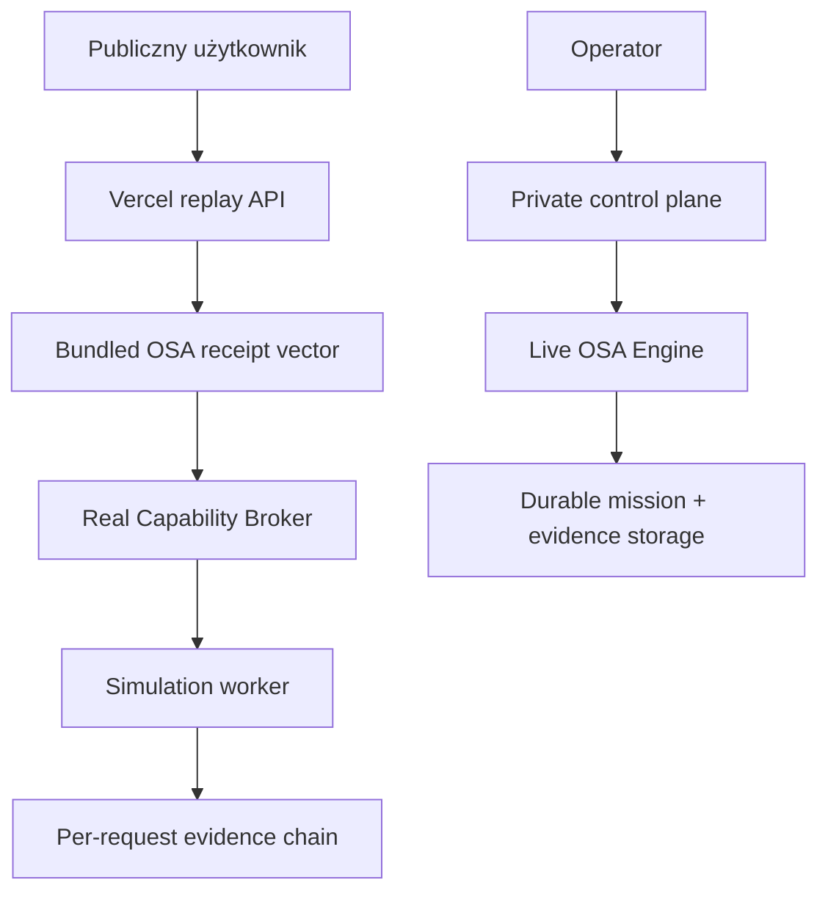

# Architecture Lock v0.1.1 — public replay deployment

Data: 2026-08-15

Status: `LOCKED_FOR_V0.1.1`
Base lock: [`ARCHITECTURE_LOCK_V0.1.md`](ARCHITECTURE_LOCK_V0.1.md)

## Objective

Udostępnić publiczny, działający panel bez przenoszenia prywatnego control plane,
sekretów, OSA Engine ani Attack Range do publicznego serverless runtime.

## Deployment split

Publiczny i prywatny przepływ współdzielą kontrakty, policy, signer, worker oraz
format evidence. Nie współdzielą sekretów ani trwałego stanu.

## Public runtime contract

| Pole | Gwarancja |
|---|---|
| Tryb | wyłącznie `LAB_RANGE` |
| Target | dokładnie jeden nieadresowalny `lab://<id>` |
| Receipt | jawnie oznaczony `BUNDLED_OSA_TEST_VECTOR` |
| Live Engine | `false` |
| Network/shell effect | `false` |
| Evidence | pięcioelementowy SHA-256 hash-chain per request |
| Persistence | `PER_REQUEST`, bez claimu durable storage |
| Operator secret | brak w publicznym kliencie |

Endpoint `POST /api/v1/demo/replay` nie tworzy prawdziwej misji. Wykonuje w
jednym requestcie signer → broker → simulation → evidence → deterministic
replay. Nowa misja wykonawcza nadal wymaga prywatnego endpointu
`POST /api/v1/missions`, poprawnego Bearer tokenu i receiptu z live OSA Engine.

## Preserved invariants

1. Publiczny runtime nie interpretuje naturalnego języka i nie jest routerem.
2. Jedynym routerem realnych misji pozostaje OSA Execution Force Engine.
3. Publiczny test vector nigdy nie otwiera adaptera z efektem sieciowym lub shell.
4. `AUTHORIZED_EXTERNAL` i `RESEARCH_PASSIVE` nie istnieją w publicznym replayu.
5. UI zawsze raportuje `live_engine_called=false` i `PER_REQUEST` persistence.
6. Prywatne endpointy na publicznym runtime pozostają zamknięte Bearer gate'em.

## Rollback

Usunięcie `api/index.py`, `vercel.json`, `src/sherlock_osa/demo.py` i publicznej
gałęzi UI przywraca deployment-neutral v0.1. Prywatny runtime nie zależy od
publicznego serwisu i może działać niezależnie przez cały rollback.
