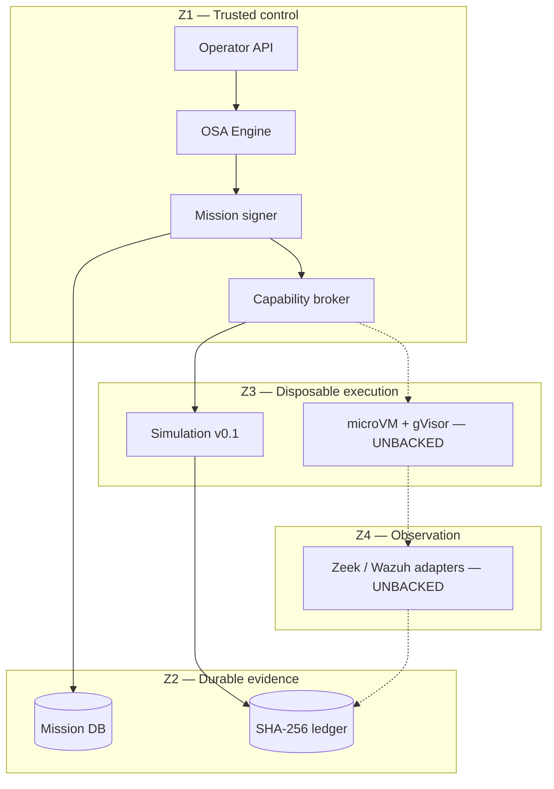

# Architecture Lock v0.1

Data: 2026-08-15
Status: `LOCKED_FOR_V0.1`
Target: `HazEOskA/OSINT-AGENT-SHERLOCK-OSA`

## Objective

Udowodnić jeden pionowy przepływ bez fałszywych claimów:

`operator intent -> OSA Engine -> signed mission -> policy decision -> simulated
adapter -> evidence hash-chain -> deterministic replay`.

## Source of truth

| Obszar | Source of truth |
|---|---|
| Router, skill contracts, MissionRuntime | `HazEOskA/osa-execution-force-skills@f365360383511fea13cd3f7af36ecbbc720ce38d` |
| Sherlock OSA scope/policy/evidence | bieżący commit tego repo |
| Referencje produktowe i licencje | `docs/REFERENCE_BENCHMARK_2026-08-15.md` |

Brak evidence ma status `UNKNOWN` lub `UNBACKED`, nigdy `PASS`.

## Trust zones

## Invariants

1. OSA Engine jest jedynym routerem skillsów i właścicielem kontraktu misji
   agentowej. Lokalny broker nie interpretuje naturalnego języka.
2. Scope jest podpisywany dopiero po otrzymaniu receiptu Engine.
3. Zmiana choćby jednego targetu, portu, capability lub czasu unieważnia podpis.
4. Broker jest deterministyczny i domyślnie odmawia.
5. `LAB_RANGE` akceptuje wyłącznie `LAB_ASSET` o wartości `lab://<id>`.
6. `AUTHORIZED_EXTERNAL` jest zablokowany, dopóki verifier własności pozostaje
   `UNBACKED`.
7. Worker v0.1 ma `network_effect_performed=false` i nie uruchamia shell.
8. Każda decyzja i symulacja trafia do łańcucha evidence.
9. Replay używa oryginalnego czasu decyzji, aby wynik nie zmieniał się tylko
   dlatego, że misja później wygasła.
10. Sekrety są redagowane przed hashowaniem i zapisem receiptu.

## API surface v0.1

| Method | Path | Efekt |
|---|---|---|
| `GET` | `/api/v1/health` | publiczny status bez sekretów |
| `GET` | `/api/v1/reference-repos` | publiczny benchmark |
| `GET` | `/api/v1/capabilities` | backing matrix |
| `POST` | `/api/v1/missions` | Engine call + podpis + persistence |
| `POST` | `/api/v1/decisions` | deterministyczna decyzja |
| `POST` | `/api/v1/executions/simulate` | brak ruchu sieciowego |
| `POST` | `/api/v1/missions/{id}/replay` | replay decyzji |
| `GET` | `/api/v1/evidence/verify` | walidacja hash-chain |

Poza health i benchmarkiem wymagany jest operator Bearer token.

## Explicit non-goals v0.1

- Tor/Whonix routing;
- wykonywanie Sherlock, Maigret, Nmap, Metasploit lub payloadów;
- Firecracker/gVisor jako wdrożona granica;
- publiczne skany i automatyczna weryfikacja własności domeny;
- LLM jako policy engine;
- produkcyjny deploy.

## Acceptance

- 20 unikalnych, licencyjnie sklasyfikowanych repo w benchmarku;
- test tamperingu podpisu;
- test target/port/capability escape;
- test fail-closed external mode;
- test wykrycia zmiany ledgeru;
- E2E smoke kończący się poprawnym replayem;
- brak zależności runtime poza Python standard library.

Zmiana inwariantów wymaga nowego ADR i wpisu `DRIFT`.
